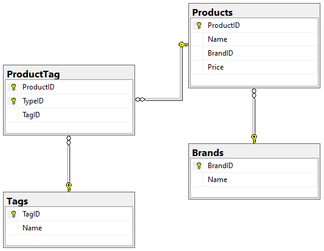

# Eshop - Joachim

## Introduktion

Projekt Eshop er en opgave der bygger på undervisning af Entity Framework core (Database OR/M) dækker over:
1. Model Creating
2. Querying Data
3. Ordering-Filtering-Paging
4. Saving data
5. Arkitektur
6. Unit Test
7. Logging og Dokumentation
8. (Deployment)

### Opgave Beskrivelse

Kan læses [her](https://ilearn.eucsyd.dk/mod/page/view.php?id=231472) på Ilearn.

## Arkitektur
Programmet er bygget op i flere dele indtil videre er den opbygget i fire dele.
- Datalayer: som står for komunikationen med databasen
- ServiceLayer: der står for oversættelse fra datalayer til frontend
- ConsoleApp: som er midlertidigt Fromntend
- UnitTest: Til test af de forskellige funktioner

## Forudsætning og installation
Der forventes at der bruges Visual Studio.

Der skal installeres disse NuGet pakker til følgene projekter:
- Datalayer
  - Microsoft.EntityFrameworkCore.SqlServer (3.1.8)
  - Microsoft.EntityFrameworkCore.Tools (3.1.8)
  - Microsoft.EntityFrameworkCore.Logging (3.1.8)
  - Microsoft.EntityFrameworkCore.Logging.Console (3.1.8)
- ConsoleApp
  - Microsoft.EntityFrameworkCore.Design (3.1.8)
- UnitTest
  - Microsoft.EntityFrameworkCore (3.1.8)
  - Microsoft.EntityFrameworkCore.InMemory (3.1.8)

## Komponenter til Software løsningen

- [x] Database der bliver håndterret af Entity Framework Core
- [x] At der bliver fulgt Data Layer -> Service Layer -> Frontend arkitektur
-  Entiteter:
   -  [x] Brand
      -  [ ] CRUD
      -  [ ] Billeder
   -  [X] Tag
      -  [ ] CRUD
   -  [x] Product
      -  [x] CRUD
      -  [ ] Billeder
   -  [ ] User
      -  [ ] CRUD
   -  [ ] Cart / Order
      -  [ ] CRUD
-  [x] Filtrer
-  [x] Sorter
-  [x] Paging
-  [x] UnitTest
-  [ ] Dokument database til Egenskaber på produkter
-  [ ] Seeding med Json
-  [x] Cookie darkmode

## ER diagram
